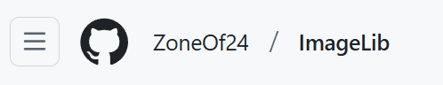
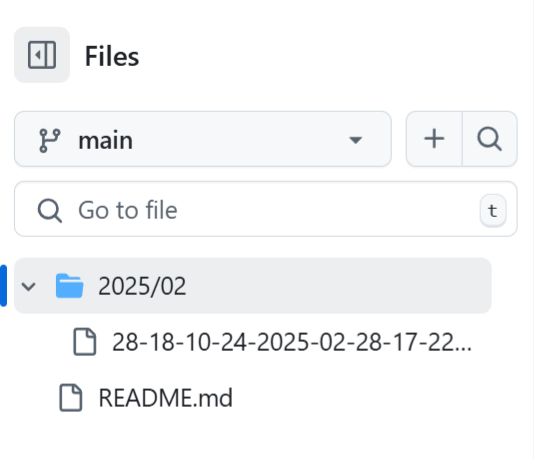

---
# 当前页面内容标题，默认为 Markdown 文件中的第一个 h1 标签内容。
title: 学习习惯
# 当前页面图标的 FontClass 或文件路径 (建议填写)
icon: pen-to-square
# 文章作者信息，作者名称，作者网站，作者邮箱
author:
  name: Mr.L
  url: https://zoneof24.github.io/tech-blog/
  email: mister-icelyb24@163.com
# 文章日期
data: 2025-02-03
# 是否为原创
isOriginal: false
# 文章分类
category: 
    - 生活随笔
# 标签
tag: 
    - 随笔
# 页面的版权信息，会在页脚中显示
copyright: Copyright © 2025 Mr.L
# 显示页面浏览量
pageview: true
# 是否将该文章添加至文章列表中
article: true
# 是否在列表中置顶。当填入数字时，数字越大，排名越靠前。
sticky: false #1, 2, 3
# 是否将该文章添加至时间线中
timeline: true
# 禁用编辑此页链接
editLink: false

---
# 学习习惯

<!-- more -->

## 放学后时间安排

1. 放学回家后，休息30分钟：喝点水，吃点水果，上厕所，在学校待了一天，缓解一下压力。

2. 写作业时，不拖拉、不说话、不边做边玩，学会使用番茄工作法。

3. 晚饭后休息半小时，然后整理当天的错题和预习明天的学习内容。

4. 剩余时间自己支配，锻炼自我承诺意识。

5. 尽量早点睡觉，保证睡眠，形成良性循环。 

## ”三个三“法则

**三不**

写作业不和别人说话

写作月不能边写边玩

写作业不能吃东西

**三到**

心到：读书作业都要用心思考

声到：边看书边小声朗读

眼到：做作业要看清内容

**三遍**

做错题：先理解再做两同类题

背课文：被错了，读三遍再背

写错字：纠正三遍再继续

## 学习步骤

**第一步：回家不要立刻写作业**

> 还在上了一天课，大脑疲惫了，回家马上写作业脑袋肯定转得慢。
> 
> 先玩半个小时（打球、跳绳等等），但是不能看手机。
> 
> 半小时活动后再去写作业效果比较好，学习效率提高，身体素质也能提高。

**第二步：给作业排计划**

> 把每科的作业按照难易程度做成任务表，每完成一项再后面打个勾。
> 
> 这样可以清楚的感觉到任务在一点一点攻克，同时也会带来成就感。

**第三步：清空桌面**

> 写作业的时候，桌面千万不要放太多东西，否则会分散注意力。
> 
> 一会儿翻书，一会儿扣扣橡皮，大脑一直切换，专注力就下降了。

**第四步：复习**

> 根据**艾宾浩斯**的遗忘曲线规律，在学校里学的东西，在放学后就忘得差不多了。
> 
> 所以一定要养成先复习，再写作业的习惯，磨刀不误砍柴工！

**第五步：番茄工作法**

> 设定闹钟，每25分钟作业，休息5分钟，直到所有作业完成。
> 
> 完成后再进行其他活动。
> 
> 5分钟休息期间不能玩手机。

